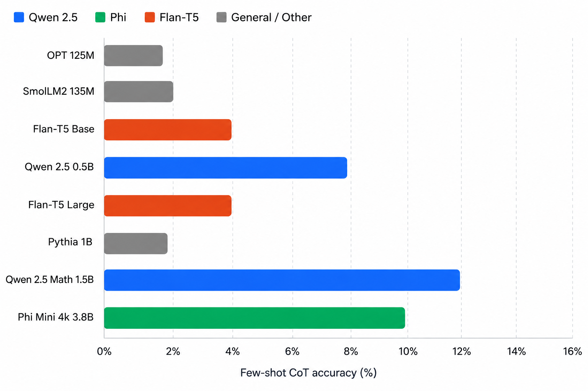

## Effect of Model Size on Accuracy with Few Shot Chain of Thought Reasoning

### Overview

The core idea is that few shot CoT prompting providing a model with a handful of example problems that include intermediate reasoning steps can dramatically unlock a model's problem-solving capability. But the key finding, popularized by Google's 2022 "Chain of Thought Prompting Elicits Reasoning in Large Language Models" paper, is that this ability is not uniformly distributed across model sizes. It appears to be an emergent property: small and medium models show little to no benefit from CoT prompts, while very large models (typically 100B+ parameters) suddenly exhibit strong performance gains



### Models Tested / To be Tested

| Model | Parameters | Architecture | Type | Context Length | Few-Shot CoT Accuracy |
|-------|-----------|--------------|------|---------------|----------------------|
| OPT 125M | 125M | Decoder-only (GPT-style) | General | 2,048 | 2% |
| SmolLM2 135M | 135M | Decoder-only | General | 2,048 | 2% |
| Flan-T5 Base | 250M | Encoder-Decoder (T5) | Instruction-tuned | 512 | 4% |
| Qwen 2.5 0.5B | 500M | Decoder-only | General | 32,768 | 8% |
| Flan-T5 Large | 780M | Encoder-Decoder (T5) | Instruction-tuned | 512 | 4% |
| Pythia 1B | 1B | Decoder-only (GPT-NeoX) | General | 2,048 | 2% |
| Qwen 2.5 Math 1.5B | 1.5B | Decoder-only | Math-specialized | 4,096 | 12% |
| Phi Mini 4k 3.8B | 3.8B | Decoder-only | General (dense) | 4,096 | 10% |

### Dataset — GSM8K

GSM8K (Grade School Math 8K) is a benchmark of 8,500 high-quality, linguistically diverse grade school math word problems, designed to test multi-step arithmetic reasoning.

- Each problem requires 2 to 8 reasoning steps
- Problems are written in natural language
- Widely used to evaluate LLM reasoning capabilities


### Few Shot Examples

Each model was prompted with these few shot examples demonstrating step by step reasoning:

```
Q: Emily has 3 apples. Her friend gives her 2 more. How many apples does Emily have now?
A: Emily starts with 3 apples. Her friend gives her 2 more. So, 3 + 2 = 5. The answer is 5.

Q: A pen costs 2 dollars. John buys 4 pens. How much does he pay?
A: Each pen costs 2 dollars. John buys 4 pens. So, 2 × 4 = 8. The answer is 8.

Q: Jake read 5 pages on Monday and 7 pages on Tuesday. How many pages did he read in total?
A: Jake read 5 pages on Monday and 7 on Tuesday. So, 5 + 7 = 12. The answer is 12.

Q: A bakery bakes 48 cookies and packs them equally into 6 boxes. They sell 3 boxes. How many cookies are left?
A: First, find cookies per box: 48 ÷ 6 = 8 cookies per box. They sell 3 boxes, so cookies sold = 3 × 8 = 24. Cookies remaining = 48 - 24 = 24. The answer is 24.

Q: Maria earns 15 dollars per hour. She works 6 hours on Saturday and 4 hours on Sunday. How much does she earn in total?
A: Saturday earnings = 15 × 6 = 90 dollars. Sunday earnings = 15 × 4 = 60 dollars. Total earnings = 90 + 60 = 150. The answer is 150.
```


### Key Observations

- Chain of Thought Reasoning is only effective for bigger models.

- The model starts to give reasoning steps if input-output chain of thought examples are provided.

- Inspite of using model bigger models upto 7B parameters, accuracy remains low on arithmetic datasets


### Reference research papers

- "Chain-of-Thought Prompting Elicits Reasoning in Large Language Models" - https://arxiv.org/abs/2201.11903
- "Large Language Models are Zero-Shot Reasoners" - https://arxiv.org/abs/2205.11916
